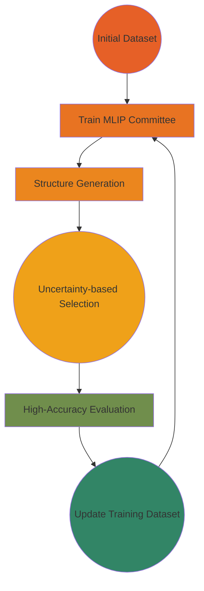

<div align="center">

</div>
<div align="center">

# `ALomancy` 🔮

**Modular Active Learning Workflows for Modern Computational Chemistry**


[](https://badge.fury.io/py/alomancy)
[](https://www.python.org/downloads/)
[](https://opensource.org/licenses/MIT)
[](https://github.com/julianholland/ALomancy/actions)
[](https://codecov.io/gh/julianholland/ALomancy)
[](https://github.com/astral-sh/ruff)
[](https://alomancy.readthedocs.io/en/latest/index.html)

[Installation](#installation) • [Quick Start](#quick-start) • [Documentation](https://alomancy.readthedocs.io/en/latest/index.html) • [Examples](#examples) • [Contributing](#contributing)

</div>

---

## 🎯 Overview

ALomnacy is a Python framework for running active learning (AL) workflows for training machine-learned inter-atomic potentials (MLIPs). This package focusses on customization and reproducibility to build robust training datasets and train MLIPs.

### Key Features

- 🚀 **Automated AL Workflows**: End-to-end active learning with minimal manual intervention
- 🔧 **HPC Integration**: Built-in support for remote job submission on HPC clusters
- ⚡ **Parallelization**: Ensures that jobs run concurrently where possible increasing speed to results
- 🔄 **Extensible Design**: Abstract base classes for easy customization and extension
- 📊 **Analysis Tools**: Built-in utilities for monitoring and analyzing AL progress

### Workflow Overview




## 🚀 Installation

### From PyPI (Recommended)

```bash
pip install alomancy
```

### From Source

```bash
git clone https://github.com/julianholland/ALomancy
cd ALomnacy
pip install -e ".[dev]"
```

### Dependencies

- Python 3.9+
- [ASE](https://wiki.fysik.dtu.dk/ase/) - Atomic Simulation Environment
- [Expyre](https://github.com/libAtoms/ExPyRe) - Remote job execution

## ⚡ Quick Start

### 1. Basic Active Learning Workflow

```python
from alomancy.core import StandardActiveLearningWorkflow
from pathlib import Path

# a bare minimum settings dict for running the StandardActiveLearningWorkflow module
# this can also be loaded in as a .yaml file (c.f. examples)

your_hpc_dict = {
  'hpc_name' : 'your_ssh_hpc_name',
  'gpu': True, # the presence of a gpu in your hpc
  'pre_cmds': ["command to enable correct python environment on your hpc"], # e.g. `conda activate alomancy` or `source ~/.venvs/alomancy/bin/activate`
  'partitions': ["hpc_partition_name"],
  'node_info': {
    'ranks_per_system': 72, # number of mpi parallelization to use per system (can be more or less than number per core )
    'ranks_per_node': 72, # number of mpi parallelizations per node
    'threads_per_rank': 1, # number of omp threads per mpi paralellization
    'max_mem_per_node': "60GB", # memore of your hpcs node
  },
  'high_accuracy_executable_path': "/path/to/your/quantum/espresso/bin/pw.x",
  'pp_path': "/path/to/your/pseudo/potentials/directory",
  'pseudo_dict': {
    'C': "name_of_carbon_pp.UPF",
    'Na': "name_of_sodium_pp.UPF", # change to elements used in your training set
  },
}

jobs_dict= {
  'mlip_committee': {
    'name': 'mace_committee',
    'size_of_committee': 3,
    'max_time': '5H',
    'mace_fit_kwargs': {
      'E0s': {
        6: -241.94038776317848,
        11: -1296.5877903540002,
      }
      'atomic_numbers': [6, 11],
      'energy_key': "REF_energy",
      'forces_key': "REF_forces",
    },
    'hpc' : your_hpc_dict
  },
  'structure_generation': {
    'name': 'md_1200_generation',
    'desired_number_of_structures': 50,
    'max_time': "10H",
    'structure_selection_kwargs':,
      'max_number_of_concurrent_jobs': 5,
      'chem_formula_list': None,
      'atom_number_range': [0, 21],
      'enforce_chemical_diversity': True,
    'run_md_kwargs':,
      'steps': 20000,
      'temperature': 1200,
      'timestep_fs': 0.5,
      'friction': 0.002,
    'hpc': your_hpc_dict,
  }

  },
  'high_accuracy_evaluation': {
    'name': 'qe_dft',
    'max_time': "30m",
    'qe_input_kwargs':,
      'system':,
        'input_dft': "pbe",
    'hpc': your_hpc_dict,
} # the hpc can/should be changed to whatever is the most appropriate hpc for each step of the workflow

# Initialize workflow
workflow = StandardActiveLearningWorkflow(
    initial_train_file_path="train_set.xyz",
    initial_test_file_path="test_set.xyz",
    jobs_dict=jobs_dict,
    number_of_al_loops=5,
    verbose=1
)

# Run the active learning workflow
workflow.run()
```

### 2. Custom Workflow Implementation

Extend the base class for specialized workflows:

```python
from alomancy.core import BaseActiveLearningWorkflow
from ase import Atoms
import pandas as pd

class CustomActiveLearningWorkflow(BaseActiveLearningWorkflow):

    def train_mlip(self, base_name: str, mlip_committee_job_dict: dict, **kwargs) -> pd.Dataframe:
        """Custom MLIP training implementation"""
        # Your custom training logic here
        return "path/to/trained/model.pt"

    def generate_structures(self, base_name: str, job_dict: dict,
                          train_data: list[Atoms], **kwargs) -> list[Atoms]:
        """Custom structure generation"""
        # Your structure generation logic here
        return generated_structures

    def high_accuracy_evaluation(self, base_name: str,
                               high_accuracy_eval_job_dict: dict,
                               structures: list[Atoms], **kwargs) -> list[Atoms]:
        """Custom high-accuracy evaluation"""
        # Your high-accuracy calculation logic here
        return evaluated_structures
```

Or just change a single function by importing the `StandardActiveLearningWorkflow` module

```python
from alomancy.core import StandardActiveLearningWorkflow

class SingleChangeActiveLearningWorkflow(StandardActiveLearningWorkflow):
  def generate_structures(self, base_name: str, job_dict: dict,
                          train_data: list[Atoms], **kwargs) -> list(Atoms):
      """new structure generation function while retaining StandardActiveLearningWorkflow's mlip training and high accuracy evaluation functionality"""
      # New structure generation logic
      return generated_structures

```
## 📚 Examples

Check out the `examples/` directory for complete workflow examples:

- **Basic Usage**: Simple active learning workflow setup
- **Custom HPC Configuration**: Advanced cluster configuration
- **Analysis Scripts**: Post-processing and visualization tools

## 🏗️ Project Structure

```
alomancy/
├── analysis/           # Analysis and visualization tools
├── configs/           # Configuration management
├── core/              # Core active learning framework
├── high_accuracy_evaluation/  # DFT calculation modules
├── mlip/              # Machine learning potential training
├── structure_generation/      # MD and structure generation
└── utils/             # Utility functions and helpers
```

In more detail

```
ALomancy
├── CHANGELOG.md                                          # Version history and release notes
├── docs/                                                 # Documentation directory
│   ├── api/
│   │   ├── core.rst                                      # Core module API documentation
│   │   └── index.rst                                     # API documentation index
│   ├── conf.py                                          # Sphinx documentation configuration
│   ├── contributing.md                                  # Contribution guidelines
│   ├── examples.md                                      # Example workflows and tutorials
│   ├── index.md                                         # Main documentation homepage
│   ├── installation.md                                  # Installation instructions
│   ├── quickstart.md                                    # Quick start guide
│   ├── usage.rst                                        # Usage documentation
│   └── requirements.txt                                 # Documentation build dependencies
├── examples/
│   └── basic_use/
│       ├── basic_use.py                                 # Complete example AL workflow script
│       ├── input_files/
│       │   ├── C_Na_amorphous_5255_train.xyz           # Sample training dataset
│       │   ├── C_Na_amorphous_583_test.xyz             # Sample test dataset
│       │   ├── hpc_config.yaml                         # Example HPC cluster configuration
│       │   └── standard_config.yaml                    # Example AL workflow configuration
├── pyproject.toml                                       # Python project configuration, dependencies, and build settings
├── pytest.ini                                          # Pytest testing configuration
├── README.md                                            # Project documentation and usage guide
├── requirements.txt                                     # Python package dependencies
├── run_tests.py                                         # Test execution script
├── src/
│   └── alomancy/
│       ├── analysis/
│       │   └── plotting.py                             # Data visualization and plotting utilities
│       ├── configs/
│       │   ├── config_dictionaries.py                  # Default configuration templates
│       │   └── remote_info.py                          # HPC cluster configuration management
│       ├── core/
│       │   ├── base_active_learning.py                 # Abstract base class for AL workflows
│       │   └── standard_active_learning.py             # Standard MACE-based AL implementation
│       ├── high_accuracy_evaluation/
│       │   └── dft/
│       │       ├── qe_remote_submitter.py               # Quantum Espresso job submission
│       │       └── run_qe.py                            # QE calculation execution
│       ├── mlip/
│       │   ├── committee_remote_submitter.py            # MACE committee training job submission
│       │   ├── get_mace_eval_info.py                    # MACE model evaluation and metrics
│       │   └── mace_wfl.py                              # MACE workflow implementation
│       ├── structure_generation/
│       │   ├── find_high_sd_structures.py               # High uncertainty structure identification
│       │   ├── md/
│       │   │   ├── generate_structures.py               # MD structure generation utilities
│       │   │   ├── md_remote_submitter.py               # Remote MD job submission
│       │   │   └── md_wfl.py                            # Molecular dynamics workflow
│       │   └── select_initial_structures.py             # Initial structure selection algorithms
│       ├── utils/
│       │   ├── clean_structures.py                      # Structure cleaning and validation utilities
│       │   ├── remote_job_executor.py                   # HPC job submission and monitoring via ExPyRe
│       │   └── test_train_manager.py                    # Test/train dataset management
│       └── version.py                                   # Automatically generated version information
├── TESTING.md                                           # Testing guidelines and procedures
└── tests/
    ├── conftest.py                                      # Pytest configuration and shared fixtures
    ├── core_tests/
    │   ├── results/
    │   │   └── test_loop_0/
    │   │       └── test_structure_generation/            # Test output directory
    │   ├── test_base_active_learning.py                 # Base AL workflow tests
    │   └── test_standard_active_learning.py             # Standard AL implementation tests
    ├── high_acc_tests/
    │   └── test_quantum_espresso.py                     # QE high-accuracy evaluation tests
    ├── mlip_train_tests/
    │   └── test_mace_training.py                        # MACE training module tests
    ├── struc_gen_tests/
    │   └── test_structure_generation.py                 # Structure generation tests
    └── utils_tests/
        └── test_utilities.py                            # Utility function
```
<!-- ## 🔧 Key Components

### Core Framework
- **BaseActiveLearningWorkflow**: Abstract base class for AL workflows
- **StandardActiveLearningWorkflow**: Ready-to-use implementation

### MLIP Training
- **MACE Integration**: Committee training with uncertainty quantification
- **Remote Submission**: HPC job management for GPU-accelerated training

### Structure Generation
- **Molecular Dynamics**: ASE-based MD simulations with MACE potentials
- **Uncertainty Sampling**: Intelligent structure selection based on model disagreement

### High-Accuracy Evaluation
- **Quantum Espresso**: Automated DFT calculations for reference data
- **Job Management**: Parallel submission and monitoring of DFT jobs -->

<!-- ## 📊 Monitoring and Analysis -->

<!-- Monitor your AL progress with built-in analysis tools:

```python
from alomancy.analysis import MACEAnalysis

# Analyze model performance
analyzer = MACEAnalysis("results/")
analyzer.plot_learning_curves()
analyzer.analyze_uncertainty_evolution()
analyzer.generate_report()
``` -->

## 🤝 Contributing

We welcome contributions! Please see our [Contributing Guide](CONTRIBUTING.md) for details.

### Development Setup

```bash
# Clone the repository
git clone https://github.com/yourusername/ALomnacy.git
cd ALomnacy

# Install in development mode
pip install -e ".[dev]"

# Run tests
pytest

# Run linting
ruff check .
ruff format .
```

### Running Tests

```bash
# Run all tests
pytest

# Run specific test categories
pytest tests/core_tests/
pytest tests/mlip_train_tests/
pytest tests/high_acc_tests/

# Run with coverage
pytest --cov=alomancy
```

## 📝 Citation

If you use ALomnacy in your research, please cite:

```bibtex
@software{alomancy2025,
  title={ALomnacy: Modular Active Learning Workflows for Modern Computational Chemistry},
  author={Julian Holland},
  year={2025},
  url={https://github.com/yourusername/ALomnacy},
  version={0.2.0}
}
```

## 📄 License

This project is licensed under the MIT License - see the [LICENSE](LICENSE) file for details.

## 🙏 Acknowledgments

- The Fritz Haber Institute
- Tom Demeyere for python inspiration

## 📞 Support

- 📖 **Documentation**: [https://alomancy.readthedocs.io](https://alomancy.readthedocs.io)
- 🐛 **Bug Reports**: [GitHub Issues](https://github.com/yourusername/ALomnacy/issues)
- 💬 **Discussions**: [GitHub Discussions](https://github.com/yourusername/ALomnacy/discussions)
- 📧 **Email**: holland@fhi.mpg.de

---
