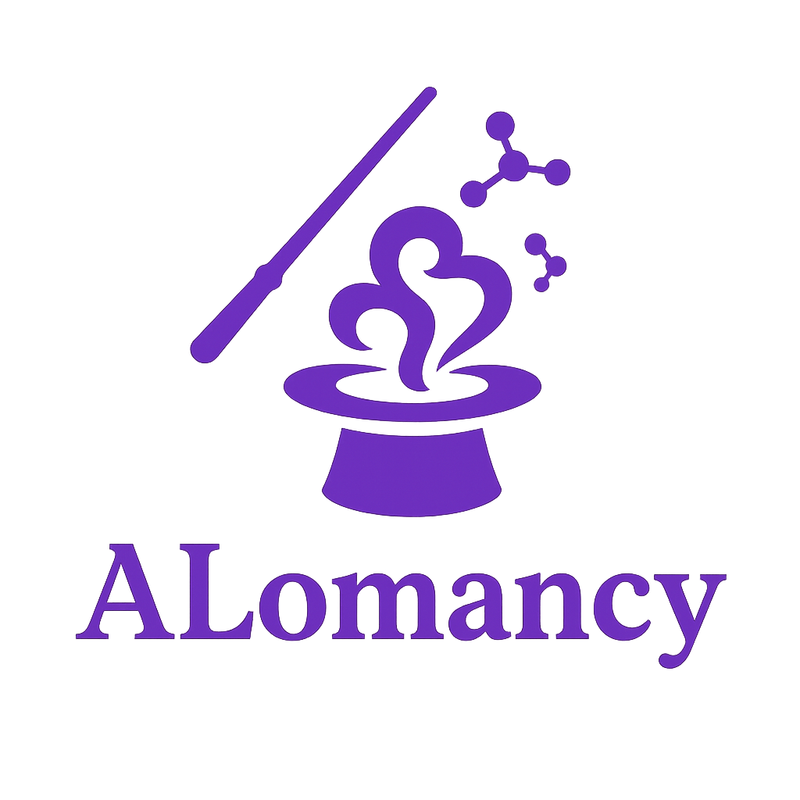
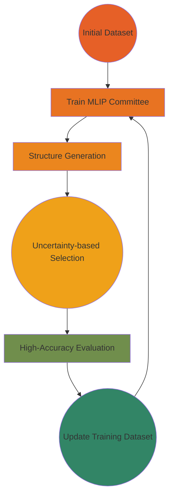

<div align="center">



# `ALomancy`

**Modular Active Learning Workflows for Modern Computational Chemistry**


[](https://badge.fury.io/py/alomancy)
[](https://www.python.org/downloads/)
[](https://opensource.org/licenses/MIT)
[](https://github.com/julianholland/ALomancy/actions)
[](https://codecov.io/gh/julianholland/ALomancy)
[](https://github.com/astral-sh/ruff)
[](https://alomancy.readthedocs.io/en/latest/index.html)

[Installation](#installation) • [Quick Start](#quick-start) • [Documentation](https://alomancy.readthedocs.io/en/latest/index.html) • [Examples](#examples) • [Contributing](#contributing)

</div>

---

## 🎯 Overview

ALomancy is a Python framework for running active learning (AL) workflows for training machine-learned inter-atomic potentials (MLIPs). This package focusses on customization and reproducibility to build robust training datasets and train MLIPs.

### Key Features

- 🚀 **Automated AL Workflows**: End-to-end active learning with minimal manual intervention
- 🔧 **HPC Integration**: Built-in support for remote job submission on HPC clusters
- ⚡ **Parallelization**: Ensures that jobs run concurrently where possible increasing speed to results
- 🔄 **Extensible Design**: Abstract base classes for easy customization and extension
- 📊 **Analysis Tools**: Built-in utilities for monitoring and analyzing AL progress

### Workflow Overview


```mermaid
flowchart TD
    A((Initial Dataset)) --> B[Train MLIP Committee]
    B --> C[Structure Generation]
    C --> D((Uncertainty-based Selection))
    D --> E[High-Accuracy Evaluation]
    E --> F((Update Training Dataset))
    F --> B

    style A fill:#e66027
    style B fill:#e87322
    style C fill:#eb861e
    style D fill:#efa119
    style E fill:#708e4c
    style F fill:#328566
```


## 🚀 Installation

### From PyPI (Recommended)

```bash
pip install alomancy
```

### From Source

```bash
git clone https://github.com/julianholland/ALomancy.git
cd ALomancy
pip install -e ".[dev]"
```

### Dependencies

- Python 3.9+
- [ASE](https://wiki.fysik.dtu.dk/ase/) — Atomic Simulation Environment
- [expyre-wfl](https://github.com/libAtoms/ExPyRe) — Remote HPC job execution
- [MACE](https://github.com/ACEsuit/mace) — Machine Learning Accelerated Computational Engine
- [sage-lib](https://github.com/sage-lib/sage-lib) — Hybrid HDF5+SQLite structure database
- [mp-api](https://github.com/materialsproject/api) — Materials Project API

## ⚡ Quick Start

### 1. Basic Active Learning Workflow

```python
from alomancy.configs.config_dictionaries import load_dictionaries
from alomancy.core.committee_uncertainty_workflow import build_workflow

# Load job configuration from YAML -- every workflow-level setting
# (initial_train_file_path, number_of_al_loops, verbose, ...) lives under
# the YAML's `general:` section; build_workflow() takes only jobs_dict.
jobs_dict = load_dictionaries("standard_config.yaml")

workflow = build_workflow(jobs_dict=jobs_dict)
workflow.run()
```

### 2. Configuration File

Create a `standard_config.yaml` file to specify your computational setup:

```yaml
general:
  al_workflow: "committee_uncertainty"
  elements: ["C", "O"]   # atomic symbols, not atomic numbers
  initial_train_file_path: "results/initialization/train_set.xyz"
  initial_test_file_path: "results/initialization/test_set.xyz"
  number_of_al_loops: 5
  verbose: 1
  committee_uncertainty_kwargs:
    number_models_in_committee: 5
    target_config_types: ["IsolatedAtom"]
    test_ratio: 0.1

initialization:
  name: "init"
  max_time: "04:00:00"
  hpc:
    hpc_name: "local"
    partitions: [""]
    pre_cmds: []

training:
  name: "mace_training"
  trainer: "mace"   # selects the registered mlip_trainer backend
  max_time: "24:00:00"
  hpc:
    hpc_name: "gpu_cluster"
    partitions: ["gpu"]
    pre_cmds: ["module load cuda", "source activate mace"]

structure_generation:
  name: "md_generation"
  generator: "md"   # "md" (default) or "ezga"
  max_time: "12:00:00"
  hpc:
    hpc_name: "gpu_cluster"
    partitions: ["gpu"]
    pre_cmds: ["module load cuda", "source activate mace"]

high_accuracy_evaluation:
  name: "dft_evaluation"
  evaluator: "qe"   # "qe" (default) or "vasp"
  max_time: "48:00:00"
  hpc:
    hpc_name: "cpu_cluster"
    partitions: ["cpu"]
    pre_cmds: ["module load quantum-espresso"]
```

### 3. Adding a New Backend

There's no subclassing to extend ALomancy: each pluggable category (trainer,
structure generator, DFT evaluator, initialiser) is a module registered
against a name in `src/alomancy/registry.py`, resolved lazily from config at
runtime (`training.trainer`, `structure_generation.generator`,
`high_accuracy_evaluation.evaluator`). Adding a new backend means writing a
new module with the category's expected entry points (`output_paths`,
`read_existing_result`, and the category-specific worker function) and
registering it — see any existing module under `mlip/`,
`structure_generation/`, or `high_accuracy_evaluation/dft/` for the pattern.

## 📚 Examples

Check out the `examples/` directory for complete workflow examples:

- **Basic Usage**: Simple active learning workflow setup
- **Custom HPC Configuration**: Advanced cluster configuration
- **Analysis Scripts**: Post-processing and visualization tools

## 🏗️ Project Structure

```
alomancy/
├── analysis/           # Analysis and visualization tools
├── configs/           # Configuration management
├── core/              # Core active learning framework
├── high_accuracy_evaluation/  # DFT calculation modules
├── initialize/        # Initialization structure generation
├── mlip/              # Machine learning potential training
├── structure_generation/      # MD and structure generation
└── utils/             # Utility functions and helpers
```

## 🔧 Key Components

### Core Framework
- **CommitteeUncertaintyWorkflow**: The AL workflow implementation, built via `build_workflow()`; resolves its trainer/structure-generator/DFT-evaluator/initialiser from config via the shared module registry rather than subclassing
- **GlobalDatabase**: Persistent HDF5+SQLite store for all DFT-evaluated structures; deduplication by (config_type, formula)
- **Structured Logging**: All output routed through Python logging; verbose=0/1/2 controls console level; file always captures DEBUG

### MLIP Training
- **MACE Integration**: Committee training with uncertainty quantification
- **Remote Submission**: HPC job management for GPU-accelerated training

### Structure Generation
- **Molecular Dynamics**: ASE-based MD simulations with MACE potentials
- **Uncertainty Sampling**: Intelligent structure selection based on model disagreement

### High-Accuracy Evaluation
- **Pluggable DFT backend**: Quantum Espresso (`calculator: "qe"`, default) or VASP (`calculator: "vasp"`) selected via config key; lazy imports keep optional dependencies isolated
- **Job Management**: Parallel submission and monitoring of DFT jobs; output directories use `ase_output_` prefix

<!-- ## 📊 Monitoring and Analysis -->

<!-- Monitor your AL progress with built-in analysis tools:

```python
from alomancy.analysis import MACEAnalysis

# Analyze model performance
analyzer = MACEAnalysis("results/")
analyzer.plot_learning_curves()
analyzer.analyze_uncertainty_evolution()
analyzer.generate_report()
``` -->

## 🤝 Contributing

We welcome contributions! Please see our [Contributing Guide](CONTRIBUTING.md) for details.

### Development Setup

```bash
# Clone the repository
git clone https://github.com/julianholland/ALomancy.git
cd ALomancy

# Install in development mode
pip install -e ".[dev]"

# Run tests
pytest

# Run linting
ruff check .
ruff format .
```

### Running Tests

```bash
# Run all tests
pytest

# Run specific test categories
pytest tests/core_tests/
pytest tests/mlip_train_tests/
pytest tests/high_acc_tests/

# Run with coverage
pytest --cov=alomancy
```

## 📝 Citation

If you use ALomancy in your research, please cite:

```bibtex
@software{alomancy2025,
  title={ALomancy: Modular Active Learning Workflows for Modern Computational Chemistry},
  author={Julian Holland},
  year={2025},
  url={https://github.com/julianholland/ALomancy},
  version={0.1.0}
}
```

## 📄 License

This project is licensed under the MIT License - see the [LICENSE](LICENSE) file for details.

## 🙏 Acknowledgments

- The Fritz Haber Institute

## 📞 Support

- 📖 **Documentation**: [https://alomancy.readthedocs.io](https://alomancy.readthedocs.io)
- 🐛 **Bug Reports**: [GitHub Issues](https://github.com/julianholland/ALomancy/issues)
- 💬 **Discussions**: [GitHub Discussions](https://github.com/julianholland/ALomancy/discussions)
- 📧 **Email**: holland@fhi.mpg.de

---
